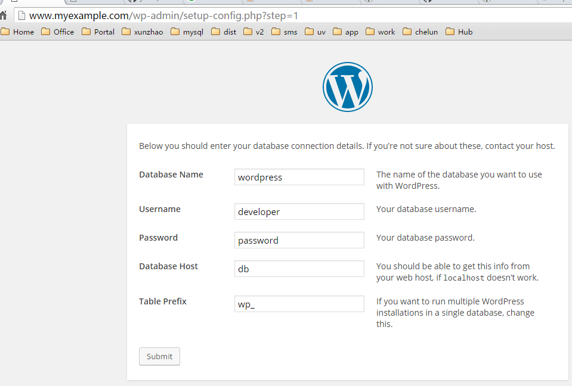

docker-lnmp
==============

Just a litle Docker POC in order to have a complete stack for running LNMP stack(Linux, Nginx, MySQL, PHP7) into Docker containers using docker-compose tool.


# Include

- Linux
- Nginx 1.9 (You can change <code>image: nginx:1.9.14</code> in docker-compose.yml to [the version](https://hub.docker.com/_/nginx/) you want)
- MySQL 5.7 (You can change <code>image: mysql</code> in docker-compose.yml to [the version](https://hub.docker.com/_/mysql/) you want)
- PHP 7 (You can change <code>FROM php:7-fpm</code> in php-fpm/Dockerfile to [the version](https://hub.docker.com/_/php/) you want  e.g. <code>FROM php:5-fpm</code>)

# Installation

First, clone this repository:

```bash
$ git clone git@github.com:ykcin/docker-lnmp.git
```

Next, create `www.myexample.com` folder outside of `docker-lnmp` and put your application into `code/www.myexample.com` folder

```
$ mkdir -p code/www.myexample.com
$ cp index.php ../code/www.myexample.com/
```

Do not forget to add your local domain e.g. `www.myexample.com` in your `hosts` file.

* Linux

Add to `/etc/hosts` file

And You have to change owner of code directory so that your php script can write.

```
chown -R www-data:www-data code
```

* Windows

Add to `C:\Windows\System32\drivers\etc\hosts` file e.g.

```
# docker
192.168.99.100 myexample.com
192.168.99.100 www.myexample.com
```

On Windows You can get your docker machine ip with

```bash
$ docker-machine ip default
192.168.99.100
```

Then, run:

```bash
$ docker-compose up
```

You are done, you can visit your application on the following URL: `http://www.myexample.com`

_Note :_ you can rebuild all Docker images by running:

```bash
$ docker-compose build
```

# How it works?

Here are the `docker-compose` built images:

* `db`: This is the MySQL database container (can be changed to postgresql or whatever in `docker-compose.yml` file),
* `nginx`: This is the Nginx webserver container in which php volumes are mounted too
* `php`: This is the PHP-FPM container including the application volume mounted on
* `phpmyadmin`: This is the phpMyAdmin container (A web interface for MySQL and MariaDB)
* `node`: This is the node container (A container for npm)

This results in the following running containers:

```bash
$ docker-compose ps
         Name                       Command             State              Ports
-------------------------------------------------------------------------------------------
dockerlnmp_db_1           docker-entrypoint.sh mysqld   Up      0.0.0.0:3306->3306/tcp
dockerlnmp_nginx_1        nginx -g daemon off;          Up      443/tcp, 0.0.0.0:80->80/tcp
dockerlnmp_node_1         node                          Exit 0
dockerlnmp_php_1          php-fpm                       Up      9000/tcp
dockerlnmp_phpmyadmin_1   /run.sh                       Up      0.0.0.0:8080->80/tcp
```

# Quickstart

## Docker Compose and WordPress

1, Download WordPress into the code directory:

```bash
$ curl -o code/wordpress.tar.gz https://wordpress.org/latest.tar.gz
  % Total    % Received % Xferd  Average Speed   Time    Time     Time  Current
                                 Dload  Upload   Total   Spent    Left  Speed
100 7580k  100 7580k    0     0   205k      0  0:00:36  0:00:36 --:--:--  149k

$ tar -xvzf code/wordpress.tar.gz -C code
```

This creates a directory called wordpress in your code directory.

2, Copy wordpress application to your project directory.

```bash
$ cp -rT code/wordpress code/www.myexample.com
```

3, You are done, you can visit your wordpress application on the following URL: `http://www.myexample.com`




## Use npm

```
$ docker run -v "$HOME/code/www.myexample.com":/usr/src/app -w /usr/src/app dockerlnmp_node npm -v
3.9.3

$ docker run -v "$HOME/code/www.myexample.com":/usr/src/app -w /usr/src/app dockerlnmp_node ls
index.php
license.txt
readme.html
wp-activate.php
wp-admin
wp-blog-header.php
wp-comments-post.php
wp-config-sample.php
wp-config.php
wp-content
wp-cron.php
wp-includes
wp-links-opml.php
wp-load.php
wp-login.php
wp-mail.php
wp-settings.php
wp-signup.php
wp-trackback.php
xmlrpc.php
```

# Read logs

You can access Nginx logs in the following directories into your host machine:

* `logs/nginx`

## License

MIT
